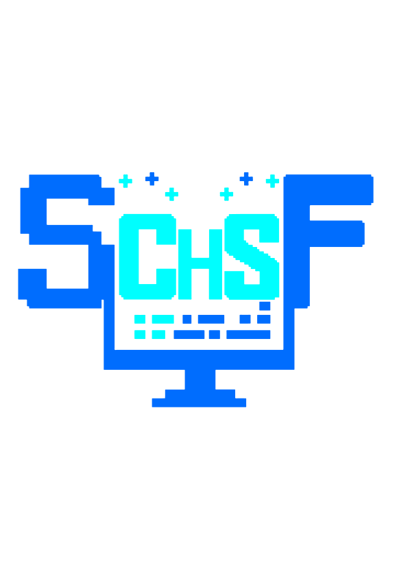

<!--Banner-->

<!--Header -->

  

<!--Header -->
#  ɪ'ᴍ Sebastian Chisavo Forero! 
*Software Engineer(Full Stack Developer / Game Developer / Software Programmer)*
  
<!--Header -->

<!--Start Intro-->               

I am a software engineer passionate about development and a fanatic for exploring this world of technology.

- ❤ Always doing something :)

- 🔄 **Software Development Lifecycle (SDLC)**  
Experience across the full SDLC: requirements analysis, system architecture, development, testing, deployment, and continuous maintenance following engineering best practices.

- 🌐 **Web Development (Full Stack)**  
Building modern web applications with frontend/backend integration, REST APIs, state management, and scalable architectures focused on performance and data-driven systems.

- 📱 **Mobile Development**  
Developing cross-platform mobile applications with strong focus on UX/UI, performance, and practical solutions such as intelligent systems and mobility applications.

- 🎮 **Interactive Applications / Game Development**  
Creating 3D interactive systems and games using Godot, implementing game mechanics, skill systems, and optimized low-poly environments.

- 🧩 **Additional Technical Skills**  
Artificial Intelligence (ML model integration), process automation (n8n), SQL/NoSQL/graph databases, analytics dashboards, version control with Git/GitHub, and collaborative development workflows.

<!--End Intro-->

## 🚀 Currently, I’m working on

- 🧠 I’m designing and creating applications and websites, covering the full software life cycle.  
- 🎮 Developing competitive interactive applications using 3D models.  
- ⚡ Building and integrating AI-powered services.  
- 📊 Creating **data-driven dashboards** for real-time analytics in business environments.  
- 🔐 Designing **cybersecurity modules** for secure authentication and user management.  
- 🌍 Developing **cross-platform mobile apps** focused on sustainability and smart mobility.

---

## 🧩 Featured Projects

- 🌐 **TrustByReviews** — Centralized digital reputation management platform built with React, TypeScript, and Node.js. Designed to connect businesses and customers, enabling transparent feedback management, reputation analysis across multiple branches, and data-driven insights to identify issues, improve services, and strengthen brand trust.  
  🔗 https://new.trustbyreviews.com/

- 🍫 **Chocolatería Virtual** — Cross-platform interactive learning application developed in Unity for PC, mobile, Meta Quest (Oculus), and HTC Vive Pro. Designed to train students in chocolate-making processes through immersive simulations and hands-on virtual environments.  
  🔗 https://play.google.com/store/apps/details?id=com.chocolateria.sena.tpc.virtuales&pcampaignid=web_share
---

## 🛠️ Tech Stack

  
| Frontend | Backend | Tools & Platforms | Design & 3D |
|-----------|----------|------------------|--------------|
|    |    |    |   |
  

---

## 📊 GitHub Stats

  
  

---

## 🌐 Connect with Me

  
  
  

---

> *“I build digital systems that blend creativity, code, and engineering to make ideas tangible.”*
